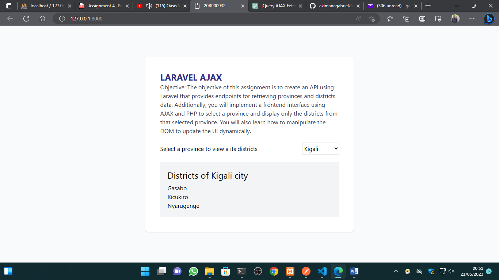

# larajax

## objective
<b>Objective:</b> The objective of this assignment is to create an API using Laravel that provides 
endpoints for retrieving provinces and districts data. Additionally, you will implement a 
frontend interface using AJAX and PHP to select a province and display only the districts 
from that selected province. You will also learn how to manipulate the DOM to update 
the UI dynamically

## Methodologies used
To achieve above objective I have used the following:
<ol>
<li>Laravel php framework
<li>jQuery JavaScript library
<li>Tailwindcss css library for front end development
<li>Postman for testing API
<li>Loading indicator while request is still processing
</ol>